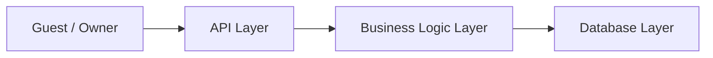
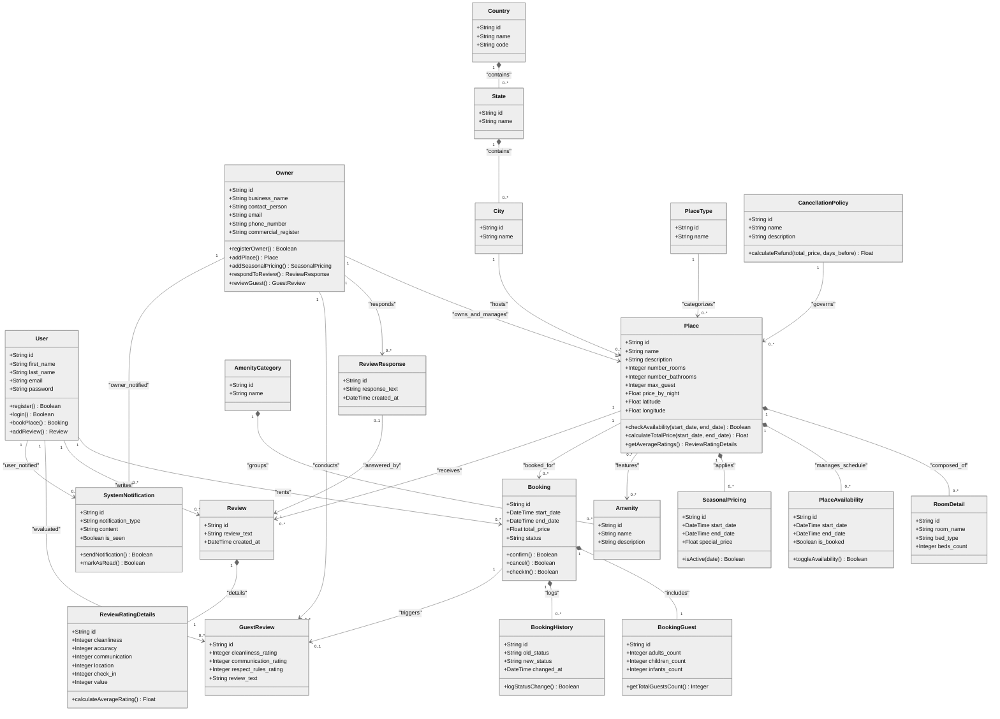
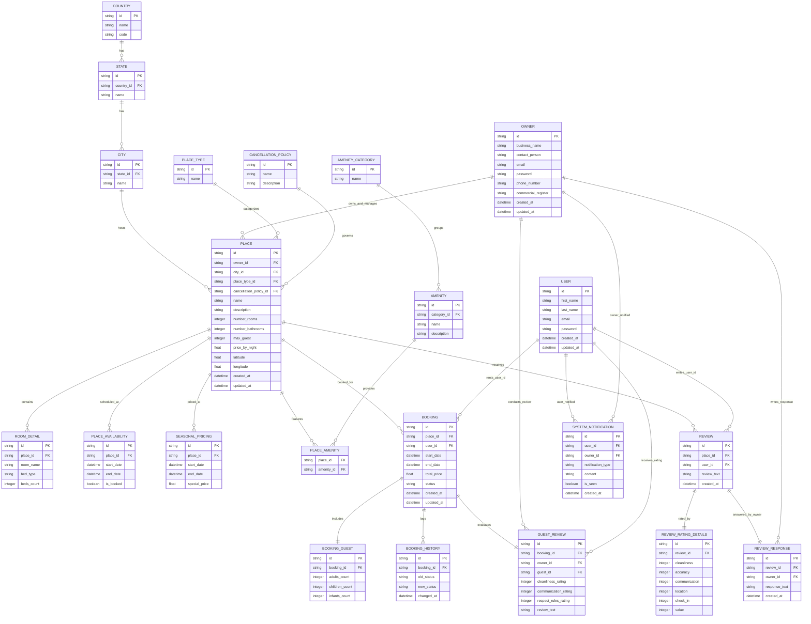
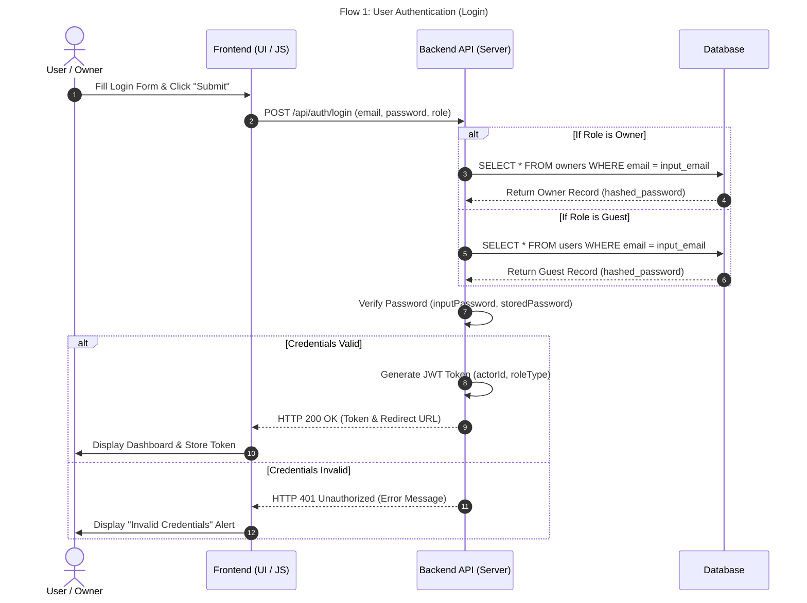
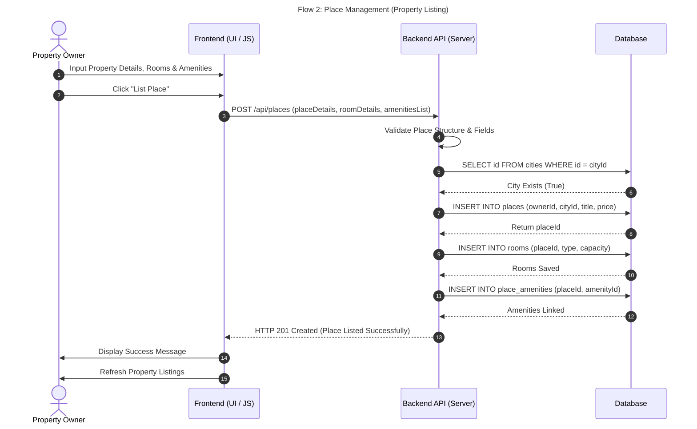
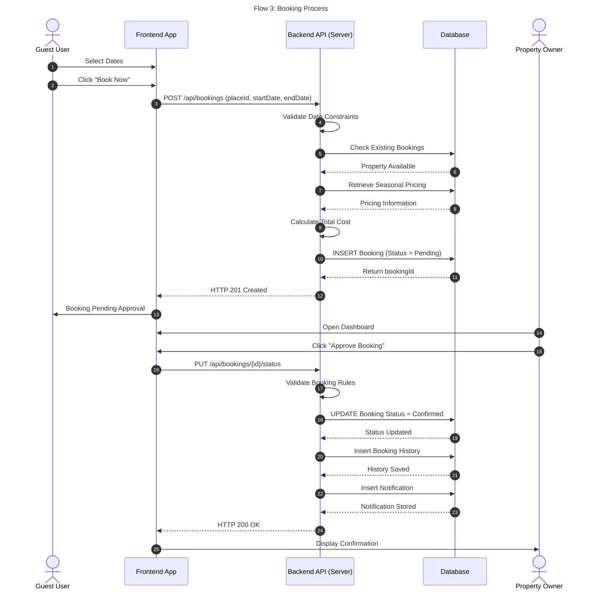
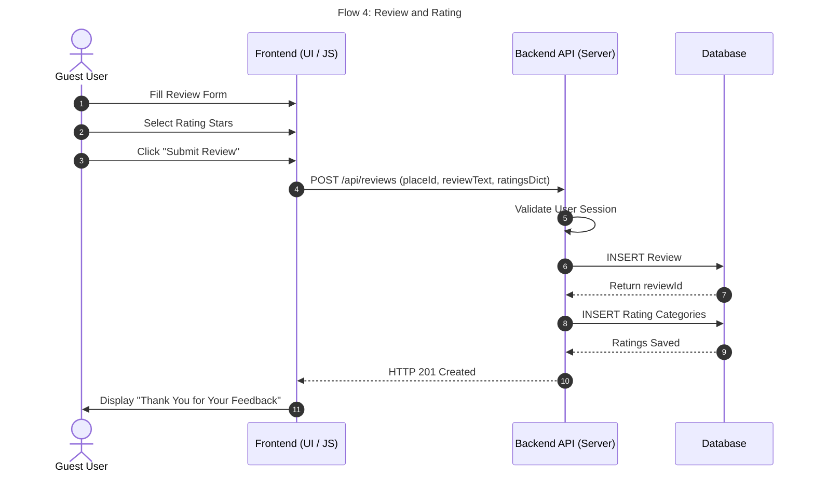

# HBnB Project  

## 1. Introduction

**HBnB project** is a rental booking system inspired by Airbnb. The system connects guests who want to book places with owners who manage rental listings.

The project includes more than basic places and reviews. It also supports bookings, booking status history, room details, amenities, availability, seasonal pricing, guest reviews, owner responses, and notifications.

## 2. Main Actors

The system has two main actors:

| Actor | Description |
| --- | --- |
| Guest/User | A person who can browse places, create bookings, and write reviews. |
| Owner | A person or business that can add places, manage bookings, and respond to reviews. |

## 3.main Features

The main features of the system are:

- Login for guests and owners.
- Add and manage rental places.
- Store room details for each place.
- Add amenities to places.
- Add seasonal prices for special date ranges.
- Save booking status history.
- Allow owners to approve bookings.
- Send system notifications.
- Allow guests to write reviews.
- Store detailed review ratings.
- Allow owners to respond to reviews.
- Allow owners to review guests after bookings.

## 4. Architecture Overview

The system uses a layered architecture. Each layer has a specific responsibility.

### 4.1 API Layer

The API Layer receives requests from guests and owners.

Responsibilities:

- Receive login, place, booking, and review requests.
- Send valid requests to the Business Logic Layer.
- Return success or error responses.
- Format the response that goes back to the user.

The API Layer should not contain the main rules of the application.

### 4.2 Business Logic Layer

The Business Logic Layer contains the rules of the system.

Responsibilities:

- Validate login information.
- Check if a user or owner exists.
- Validate place data.
- Check booking dates.
- Check place availability.
- Calculate total booking price.
- Apply seasonal pricing when needed.
- Update booking status.
- Save booking history.
- Create notifications.
- Validate reviews and rating details.

This layer decides whether an action is allowed or not.

### 4.3 Database Layer

The Database Layer stores all project data.

Responsibilities:

- Store users and owners.
- Store places and related details.
- Store bookings and booking history.
- Store reviews and rating details.
- Store notifications.
- Keep relationships between tables organized.

## 5. Domain Model

The domain model describes the main objects in the system and how they are related.

### 5.1 Main Entities

| Entity | Purpose |
| --- | --- |
| User | Stores guest information and connects guests to bookings and reviews. |
| Owner | Stores owner and business information. |
| Place | Stores rental listing information. |
| Booking | Stores reservation information. |
| Booking History | Stores booking status changes. |
| Room Detail | Stores room name, bed type, and bed count. |
| Amenity | Stores features available in places. |
| Review | Stores guest feedback about places. |
| Review Rating Detail | Stores detailed rating scores. |
| Review Response | Stores owner replies to reviews. |
| Guest Review | Stores owner feedback about guests. |
| Notification | Stores messages sent by the system. |

### 5.2 Entity Details

**User** stores guest data such as name, email, password, and timestamps. A user can create bookings and write reviews.

**Owner** stores business data such as business name, contact person, email, phone number, commercial register, and timestamps. An owner can create places and approve bookings.

**Place** stores listing data such as owner, city, place type, cancellation policy, name, description, room count, bathroom count, maximum guests, nightly price, latitude, and longitude.

**Booking** stores the selected place, guest, start date, end date, total price, and booking status.

**Review** stores feedback text written by guests. Detailed rating values are stored in a separate table.

**Amenity** stores services or features that can be attached to a place, such as Wi-Fi, parking, or kitchen.

**Notification** stores system messages for guests and owners, such as booking confirmation updates.

## 6. Database Design

The database is designed to separate information into clear tables. This avoids repeated data and makes the system easier to update.

### 6.1 Main Tables

| Table | Description |
| --- | --- |
| `users` | Stores guest accounts. |
| `owners` | Stores owner and business accounts. |
| `countries` | Stores country data. |
| `states` | Stores state or region data. |
| `cities` | Stores city data. |
| `place_types` | Stores place type options. |
| `cancellation_policies` | Stores cancellation policy details. |
| `places` | Stores main place information. |
| `room_details` | Stores room and bed details for each place. |
| `amenity_categories` | Stores amenity groups. |
| `amenities` | Stores available amenities. |
| `place_amenities` | Connects places with amenities. |
| `place_availability` | Stores available or booked date ranges. |
| `seasonal_pricing` | Stores special prices for certain dates. |
| `bookings` | Stores booking records. |
| `booking_guests` | Stores adults, children, and infants count. |
| `booking_history` | Stores booking status changes. |
| `reviews` | Stores guest reviews for places. |
| `review_rating_details` | Stores rating scores for reviews. |
| `review_responses` | Stores owner replies to reviews. |
| `guest_reviews` | Stores owner reviews for guests. |
| `system_notifications` | Stores notifications. |

### 6.2 Important Relationships

- One owner can create many places.
- One place belongs to one owner.
- One city can contain many places.
- One user can create many bookings.
- One booking belongs to one user and one place.
- One booking can have guest count details.
- One booking can have many history records.
- One place can have many room details.
- One place can have many availability records.
- One place can have many seasonal pricing records.
- One place can have many reviews.
- One review belongs to one user and one place.
- One review can have rating details.
- One review can have an owner response.
- One place can have many amenities.
- One amenity can be used by many places.
- A notification can be linked to a user or an owner.

## 7. Business Rules

The system follows these rules:

- A user must have a valid email.
- An owner must have a valid email.
- A place must belong to an existing owner.
- A place must be connected to an existing city.
- A place must have a valid place type.
- A place must have a valid cancellation policy.
- A booking must belong to an existing user and place.
- The start date must be before the end date.
- The system must check availability before creating a booking.
- The system must calculate the total price before saving the booking.
- Seasonal pricing should be used when the booking date matches a special price period.
- A new booking starts with the `Pending` status.
- Only the owner can approve a booking for their place.
- Every booking status change should be saved in `booking_history`.
- A review must belong to an existing user and place.
- Rating values should be within the accepted range.
- Owner responses should be linked to existing reviews.
- Guest reviews should be linked to valid bookings.

## 8. Main System Flows

This section contains the sequence diagrams for the main functions in the Accommodation Booking System. Each diagram shows how the frontend, backend, and database work together to complete a task.

## 8.1 User Authentication Flow

This diagram shows how a user logs into the system. The user enters their email and password, then the system checks the information. If everything is correct, the user can access the dashboard.

## 8.2 Place Management Flow

This diagram shows how the property owner adds a new place. The system checks the entered information, saves the property, rooms, and amenities, then confirms that the listing was created successfully.

## 8.3 Booking Process Flow

This diagram explains the booking process. The guest sends a booking request, the system checks if the place is available, calculates the total price, and saves the booking. After that, the owner can approve the booking.

## 8.4 Review and Rating Flow

This diagram shows how a guest submits a review after staying at a property. The system saves the review and ratings, then shows a confirmation message.

## 9. Suggested API Endpoints

| Method | Endpoint | Description |
| --- | --- | --- |
| `POST` | `/auth/login` | Login as guest or owner. |
| `POST` | `/places` | Create a new place. |
| `GET` | `/places` | Get all places. |
| `GET` | `/places/{placeId}` | Get one place. |
| `POST` | `/bookings` | Create a new booking. |
| `PATCH` | `/bookings/{bookingId}/status` | Update booking status. |
| `GET` | `/bookings/{bookingId}/history` | Get booking history. |
| `POST` | `/places/{placeId}/reviews` | Add a review for a place. |
| `POST` | `/reviews/{reviewId}/responses` | Add owner response to a review. |
| `POST` | `/bookings/{bookingId}/guest-review` | Add owner review for a guest. |
| `GET` | `/notifications` | Get system notifications. |

## 10. Booking Status Values

| Status | Meaning |
| --- | --- |
| `Pending` | The booking is waiting for owner approval. |
| `Confirmed` | The booking has been approved by the owner. |
| `Rejected` | The booking has been rejected by the owner. |
| `Cancelled` | The booking has been cancelled. |

## 11. Project Diagrams

| Diagram | Link |
| --- | --- |
| Class Diagram | [Domain Model](#5-domain-model) |
| Database ERD | [Database Design](#6-database-design) |
| User Authentication Flow | [User Authentication Flow](#81-user-authentication-flow) |
| Place Management Flow | [Place Management Flow](#82-place-management-flow) |
| Booking Process Flow | [Booking Process Flow](#83-booking-process-flow) |
| Review and Rating Flow | [Review and Rating Flow](#84-review-and-rating-flow) |

## 12. Conclusion

This document explains the main technical design of the HBnB Booking Platform. It describes the system actors, architecture, entities, database tables, relationships, business rules, and important system flows.

The design separates the API, business logic, and database responsibilities. This makes the project easier to build, understand, and improve in future stages.

## Team Members
Abeer Alsayari ،
Ghadi Alzhrani ،
Tala Alhudhaybi ،
Aseel Alzhrani ،
