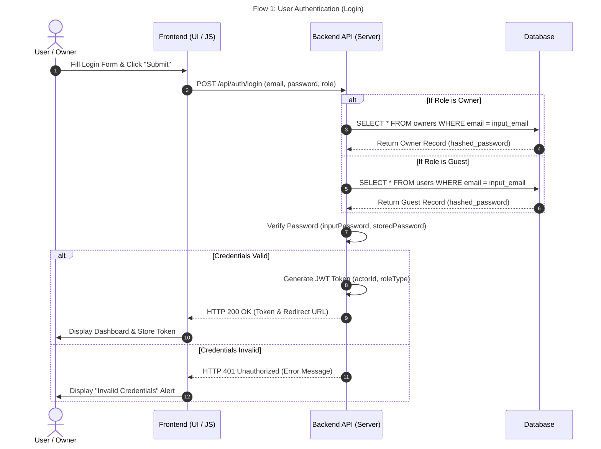
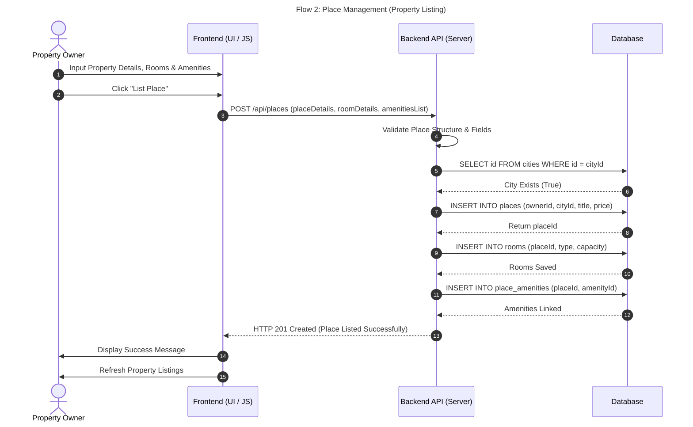
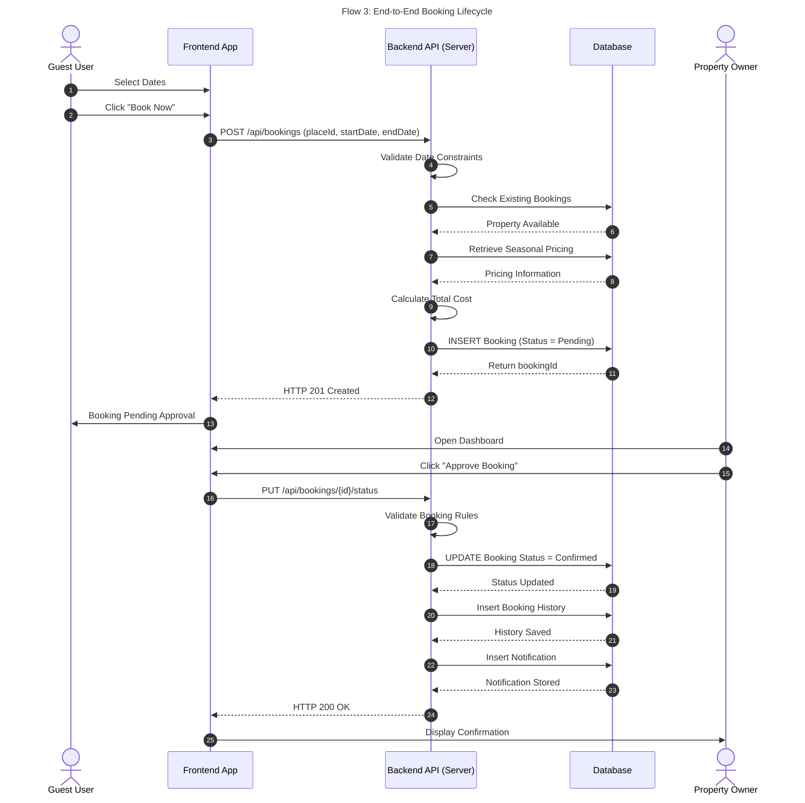

# System Sequence Diagrams

This document describes the main sequence diagrams for the Accommodation Booking System.
Each diagram represents one major business process between the User Interface, Backend API, and Database.

---

# Flow 1: User Authentication (Login)

### Description
This sequence illustrates how users authenticate into the system. The frontend collects the login credentials, the backend validates them against the database based on the selected role (Owner or Guest), verifies the password, generates a JWT token upon success, and returns the appropriate response.

---

# Flow 2: Place Management (Property Listing)

### Description
This sequence describes how a property owner lists a new accommodation. The backend validates the submitted information, verifies the selected city, stores the property, saves room information, links amenities, and confirms successful creation.

---

# Flow 3: End-to-End Booking Lifecycle

### Description
This sequence demonstrates the complete booking lifecycle. A guest submits a booking request, the backend checks availability and pricing, creates a pending booking, then the property owner reviews and confirms the reservation, triggering notifications and booking history updates.

---

# Flow 4: Review and Rating System

### Description
This sequence illustrates how guests submit reviews after completing a stay. The backend validates the request, stores the review and detailed ratings, then returns a confirmation to the frontend.

---

# Summary

| Flow | Description |
|------|-------------|
| Flow 1 | User authentication using role-based login and JWT generation. |
| Flow 2 | Property owners create and publish accommodation listings. |
| Flow 3 | Complete booking workflow from booking request to owner approval. |
| Flow 4 | Guests submit reviews and ratings after their stay. |
