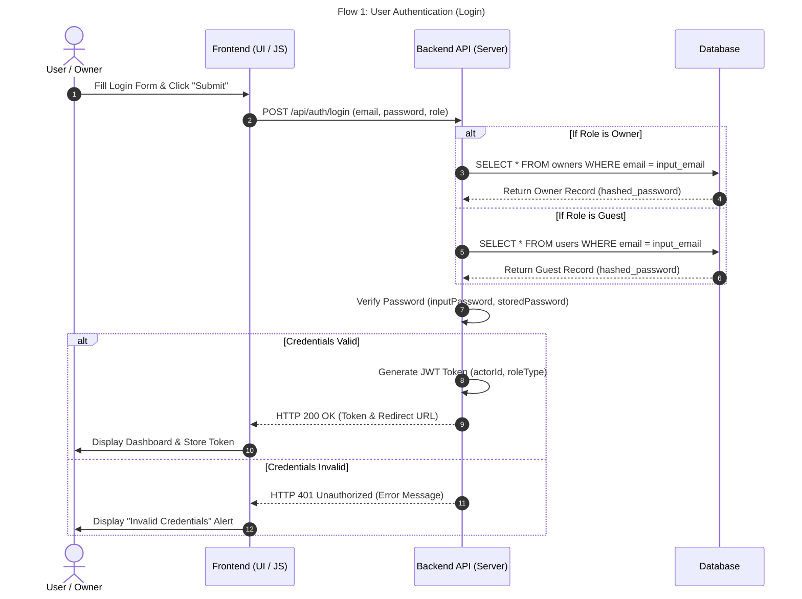
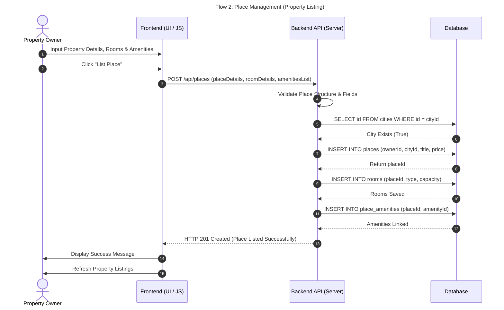
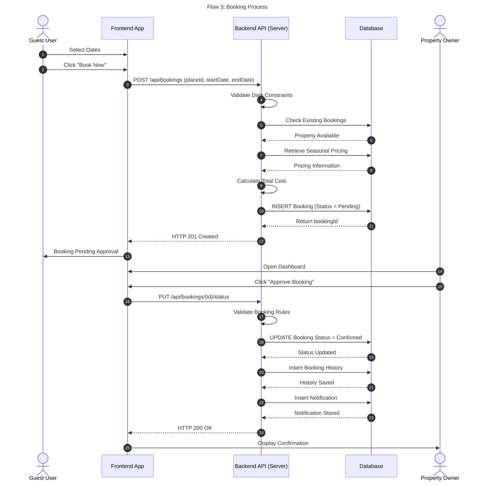
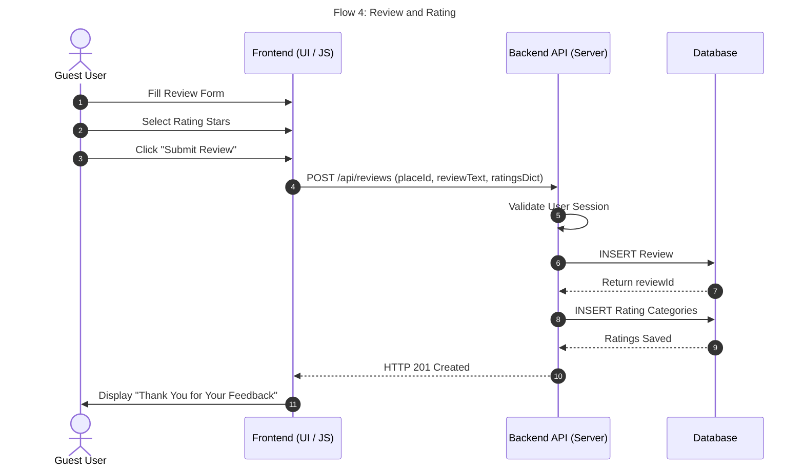

# System Sequence Diagrams

This section contains the sequence diagrams for the main business processes of the HBnB system. Each diagram illustrates how the User, Frontend, Backend API, and Database interact to complete a specific operation, showing the flow of requests, validations, and responses throughout the system.

---

# Flow 1: User Authentication (Login)

### Purpose

This sequence diagram illustrates the user authentication process. It shows how the user's login credentials are submitted through the frontend, validated by the backend, and verified against the database before access to the system is granted.

### Components

- User
- Frontend
- Backend API
- Database

### Explanation

The user enters an email address and password through the frontend interface. The frontend sends the login request to the Backend API, which validates the submitted credentials against the database. If the credentials are valid, the backend returns a successful authentication response and the user is granted access to the dashboard. Otherwise, an error response is returned and the user is prompted to try again.

---

# Flow 2: Place Management (Property Listing)

### Description
This diagram shows how the property owner adds a new place. The system checks the entered information, saves the property, rooms, and amenities, then confirms that the listing was created successfully.

---

# Flow 3: Booking Process

### Description
This diagram explains the booking process. The guest sends a booking request, the system checks if the place is available, calculates the total price, and saves the booking. After that, the owner can approve the booking.

---

# Flow 4: Review and Rating

### Description
This diagram shows how a guest submits a review after staying at a property. The system saves the review and ratings, then shows a confirmation message.

