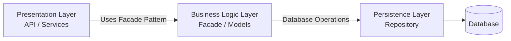
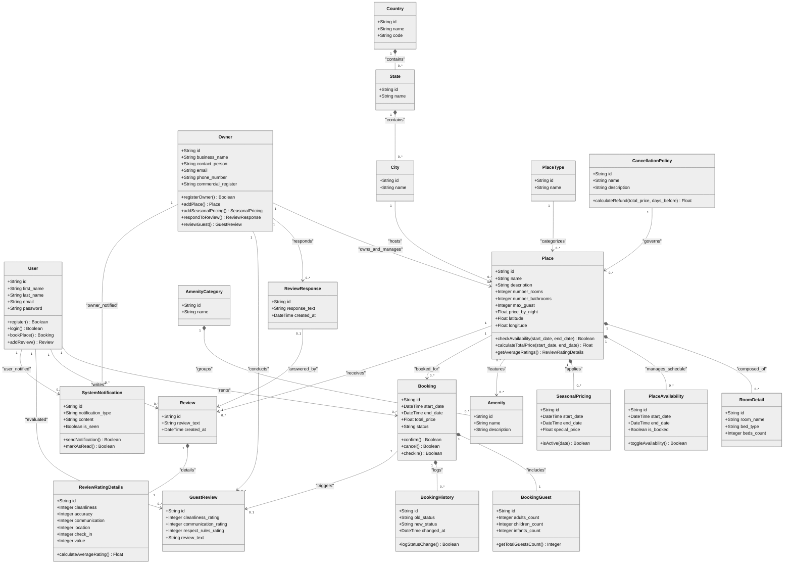
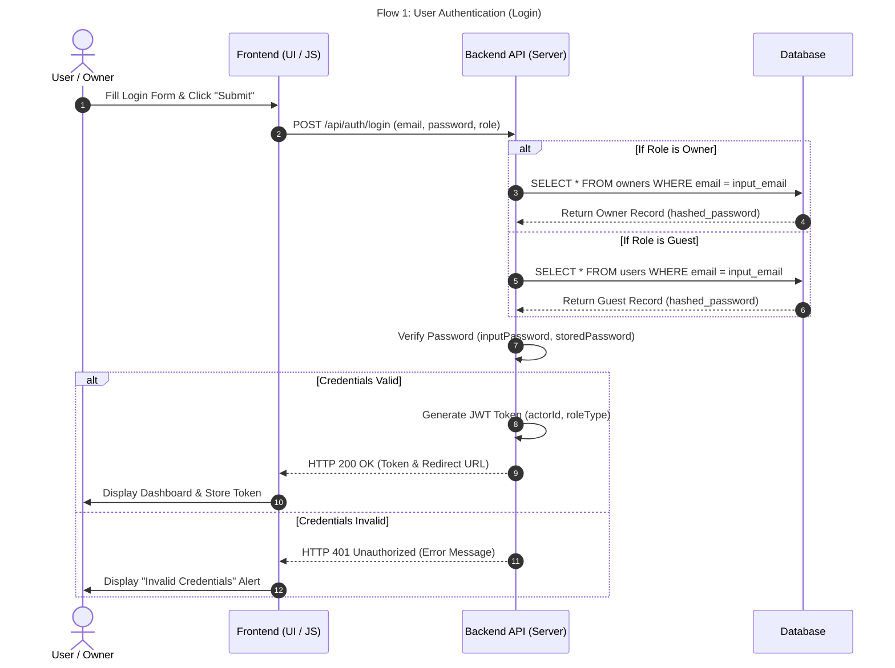
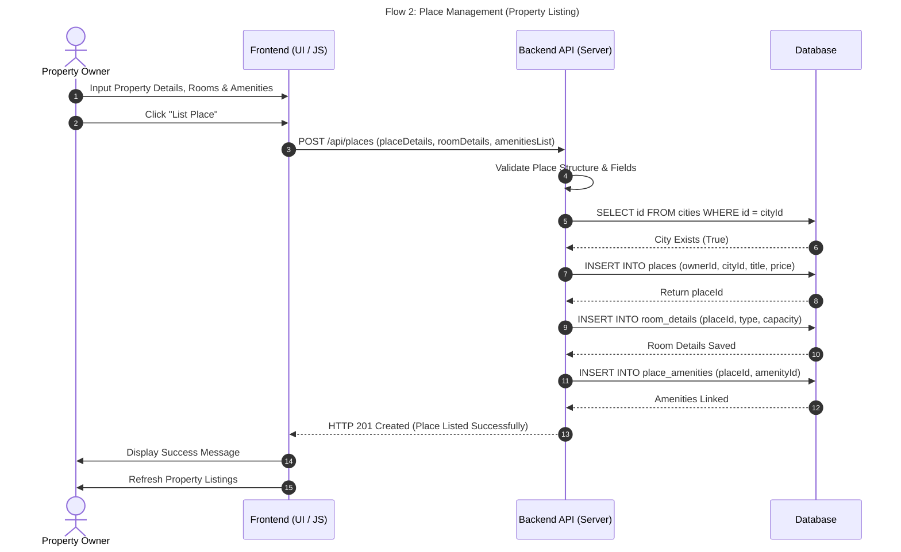
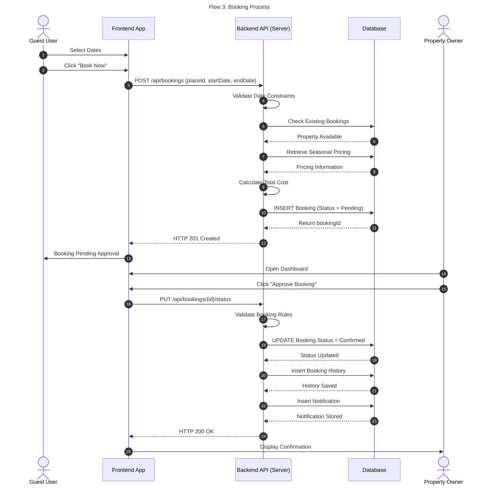
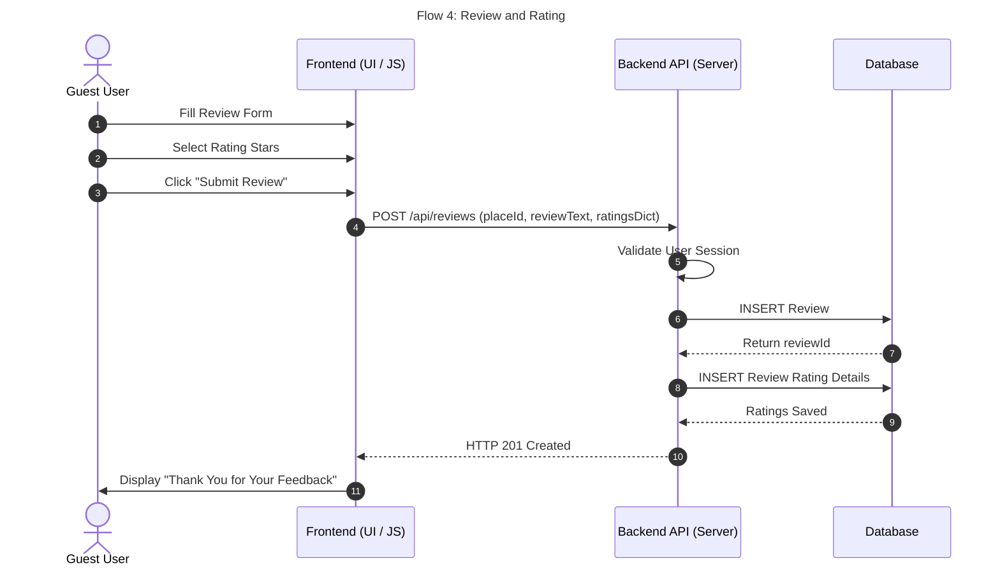

# HBnB Documentation

## Introduction

This document presents the technical design of the HBnB project.

### This document includes:

- High-Level Package Diagram
- Database Entity Relationship Diagram (ERD)
- Business Logic Class Diagram
- API Sequence Diagrams

---

# 1. High-Level Architecture

The High-Level Package Diagram illustrates the overall architecture of the HBnB application. It shows how the different layers communicate while keeping each layer responsible for a specific part of the system.

## Main Components

- **Presentation Layer:** Handles user interactions and forwards requests to the business layer.
- **Business Logic Layer:** Processes business rules, validates requests, and coordinates system operations.
- **Persistence Layer:** Manages data access and communication with the database.
- **Database:** Stores the application's persistent data and maintains data integrity.

## Design Decisions

The project follows a layered architecture to separate responsibilities and improve maintainability, scalability, and readability. A Facade pattern is implemented in the Business Logic layer to provide a single entry point for handling application requests before interacting with the persistence layer.

---

# 2. Business Logic Layer

The Class Diagram represents the Business Logic layer of the HBnB system. It illustrates the main classes, their attributes, methods, and relationships, showing how the application's business objects collaborate to implement the system's functionality.

## Main Classes

The Business Logic layer is composed of several classes, each responsible for a specific part of the system:

- **User:** Represents registered users who can create bookings, submit reviews, and receive system notifications.
- **Owner:** Represents property owners who manage places, configure seasonal pricing, respond to reviews, and evaluate guests.
- **Place:** Represents a property available for booking. It stores general information and is associated with room details, availability schedules, amenities, bookings, and reviews.
- **Booking:** Represents a reservation made by a user. It manages booking dates, status, guest information, and booking history.
- **Review:** Represents feedback submitted by users after a stay, including detailed rating information.
- **Amenity:** Represents facilities or services provided by a place, grouped by amenity categories.
- **SystemNotification:** Represents notifications sent to users for important system events.

Supporting classes such as **Country**, **State**, **City**, **PlaceType**, **CancellationPolicy**, **RoomDetail**, **PlaceAvailability**, **SeasonalPricing**, **AmenityCategory**, **BookingGuest**, **BookingHistory**, **ReviewRatingDetails**, **ReviewResponse**, and **GuestReview** organize location data, property details, pricing rules, booking information, and review management while supporting the core business objects.
## Relationships

The classes are connected through associations and aggregations where appropriate. For example, an Owner can manage multiple Places, a User can create multiple Bookings and Reviews, and each Place can contain multiple Amenities while maintaining Booking and Review records. These relationships represent the application's business rules and object interactions.

## Design Decisions

The Business Logic layer follows an object-oriented design where each class has a specific responsibility. Attributes store the object's data, methods define its behavior, and relationships organize the interaction between objects. This modular design improves maintainability, scalability, and future extensibility.

---

# 3. API Interaction Flow

This section contains the sequence diagrams for the main business processes of the HBnB system. Each diagram illustrates how the User, Frontend, Backend API, and Database interact to complete a specific operation.

---

## Flow 1 – User Authentication (Login)

This sequence diagram illustrates the user authentication process.

### Components

- User
- Frontend
- Backend API
- Database

### Explanation

The user enters an email address and password through the frontend interface. The frontend sends the login request to the Backend API, which validates the submitted credentials against the database. If the credentials are valid, the backend returns a successful authentication response and grants access to the dashboard. Otherwise, an error response is returned.

---

## Flow 2 – Place Management (Property Listing)

This sequence diagram illustrates how a property owner creates a new place listing.

### Components

- Property Owner
- Frontend
- Backend API
- Database

### Explanation

The property owner enters the place information, room details, and amenities through the frontend. The Backend API validates the submitted data, creates the related records in the database, and returns a success response after the property has been stored successfully.

---

## Flow 3 – Booking Process

This sequence diagram illustrates the complete booking workflow.

### Components

- Guest User
- Frontend
- Backend API
- Database
- Property Owner

### Explanation

The guest selects a property and submits a booking request. The Backend API verifies availability, calculates the booking cost, and stores the booking in the database. The property owner reviews the request, and once approved, the booking status is updated, a booking history record is created, and a notification is generated before the confirmation is returned to the guest.

---

## Flow 4 – Review and Rating

This sequence diagram illustrates how users submit reviews and ratings after their stay.

### Components

- Guest User
- Frontend
- Backend API
- Database

### Explanation

The guest submits a review and rating through the frontend. The Backend API validates the request, stores the review and rating in the database, and returns a confirmation response indicating that the review has been successfully submitted.

---

# Conclusion

This technical documentation provides a complete overview of the HBnB system design by combining the system architecture, database design, business logic, and API interaction diagrams into a single reference. Together, these diagrams establish a clear blueprint that supports implementation, maintenance, and future development while ensuring consistency across all system components.
